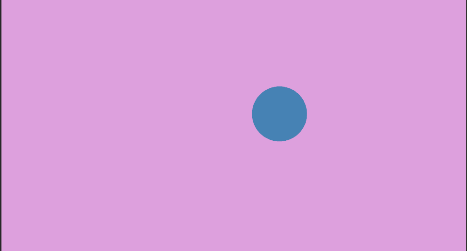

<!-- # Animating a Circle -->
# 円のアニメーション

<!-- **Tutorial Info** -->
**チュートリアル情報**

- 著者: [madskjeldgaard](https://madskjeldgaard.dk)
- 必要な知識:
    - [はじめに](/getting_started.md)
    - [nannouアプリの解剖](/tutorials/basics/anatomy-of-a-nannou-app.md)
    - [2D図形の描画](/tutorials/basics/drawing-2d-shapes.md)
- 読書時間：10分
---



<!-- # Moving a circle about on the screen -->
# スクリーン上で円を動かす

<!-- In this tutorial we will cover the basics of moving a shape around in the window of a nannou app. -->
このチュートリアルでは、南雲アプリのウィンドウ内でシェイプを移動させる基本について説明します。

<!-- Let's start by making a simple program which draws a circle in the center of the screen. -->
まず、画面の中心に円を描く簡単なプログラムを作ってみよう。

<!-- We will be using the barebones app from [Anatomy of a nannou app](/tutorials/basics/anatomy-of-a-nannou-app.md) as a starting point for this. -->
ここでは、[nannouアプリの解剖](/tutorials/basics/anatomy-of-a-nannou-app.md)にあるベアボーン・アプリを出発点として使います。

<!-- Update the view function of your nannou-app to look like this: -->
nannou-appのview関数を以下のように更新する：

```rust,no_run
# #![allow(dead_code)]
# #![allow(unused_imports)]
# extern crate nannou;
# use nannou::prelude::*;
# struct Model{}
# fn main() {
#    nannou::app(model)
#        .event(event)
#        .simple_window(view)
#        .run();
# }
# fn model(_app: &App) -> Model {
#    Model {}
# }
# fn event(_app: &App, _model: &mut Model, _event: Event) {
# }
fn view(app: &App, _model: &Model, frame: Frame) {
	// Prepare to draw.
    let draw = app.draw();

    // Clear the background to purple.
    draw.background().color(PLUM);

	// Draw a blue ellipse with a radius of 10 at the (x,y) coordinates of (0.0, 0.0)
    draw.ellipse().color(STEELBLUE).x_y(0.0,0.0);

    draw.to_frame(app, &frame).unwrap();
}
```

<!-- ## Adding movement -->
## 動きを加える

<!-- Let's now add some movement to our circle to give it a bit of life. -->
では、円に動きを加えて、生命力を与えてみよう。

<!-- To do this, we will make use of the ever wonderful [sinewave](https://en.wikipedia.org/wiki/Sine_wave). -->
そのために、素晴らしい[サイン波](https://en.wikipedia.org/wiki/Sine_wave)を利用する。

<!-- These can be generated in nannou by taking the progressed time of the application and feeding it to a sine function. -->
これらは、アプリケーションの進行時間を取り、正弦関数に与えることでnannouで生成することができる。

```rust,no_run
# #![allow(unreachable_code, unused_variables)]
# use nannou::prelude::*;
# fn main() {
#     let app: App = unimplemented!();
let sine = app.time.sin();
# }
```

<!-- Let's make another one but at half the speed by dividing the time value by two -->
時間値を2で割って、半分のスピードのものを作ってみよう。

```rust,no_run
# #![allow(unreachable_code, unused_variables)]
# use nannou::prelude::*;
# fn main() {
#     let app: App = unimplemented!();
let slowersine = (app.time / 2.0).sin();
# }
```

<!-- Now that we have two functions generating nice, smooth wave movements, let's use them to control our little circle. -->
さて、きれいで滑らかな波の動きを生成する2つの関数ができたので、それを使って小さな円をコントロールしてみよう。

<!-- If we put these values directly in the ellipse's `.x_y()`-method we would not see much movement. That's because the sine waves generate values between -1.0 and 1.0 and the coordinates expect a pixel position. -->
これらの値を楕円の `.x_y()` メソッドに直接入れても、あまり動かないだろう。正弦波は-1.0から1.0の間の値を生成し、座標はピクセルの位置を期待するからだ。

<!-- But how wide is our window ? To get a precise idea of this, we can use a handy method called [window_rect](https://docs.rs/nannou/latest/nannou/app/struct.App.html#method.window_rect) which is available in the `app` variable. -->
しかし、私たちのウィンドウの幅はどれくらいでしょうか？これを正確に知るには、`app`変数で利用できる[window_rect](https://docs.rs/nannou/latest/nannou/app/struct.App.html#method.window_rect)という便利なメソッドを使うことができる。

```rust,no_run
# #![allow(unreachable_code, unused_variables)]
# use nannou::prelude::*;
# fn main() {
#     let app: App = unimplemented!();
let boundary = app.window_rect();
# }
```

<!-- This will give us the boundary of the window as a handy `Rect`. This is a struct that responds to [tons of useful methods](https://docs.rs/nannou/latest/nannou/geom/rect/struct.Rect.html) that we can use to define the minimum and maximum values of our x and y coordinates respectively to constrain the movements of our circle. -->
これでウィンドウの境界が便利な `Rect` として得られる。これは[便利なメソッドの数々](https://docs.rs/nannou/latest/nannou/geom/rect/struct.Rect.html)に応答する構造体で、x座標とy座標のそれぞれの最小値と最大値を定義して、円の動きを制約するのに使うことができる。

<!-- The minimum x value is thus available as: -->
したがって、xの最小値は次のようになる：

```rust,no_run
# #![allow(unreachable_code, unused_variables)]
# use nannou::prelude::*;
# fn main() {
#     let boundary: geom::Rect = unimplemented!();
boundary.left();
# }
```

<!-- And the maximum x value is -->
そして、xの最大値は

```rust,no_run
# #![allow(unreachable_code, unused_variables)]
# use nannou::prelude::*;
# fn main() {
#     let boundary: geom::Rect = unimplemented!();
boundary.right();
# }
```

<!-- The minimum y value is -->
y値の最小値は

```rust,no_run
# #![allow(unreachable_code, unused_variables)]
# use nannou::prelude::*;
# fn main() {
#     let boundary: geom::Rect = unimplemented!();
boundary.bottom();
# }
```

<!-- And the maximum y value is -->
そしてyの最大値は

```rust,no_run
# #![allow(unreachable_code, unused_variables)]
# use nannou::prelude::*;
# fn main() {
#     let boundary: geom::Rect = unimplemented!();
boundary.top();
# }
```

<!-- ## Mapping values to a range -->
## 値を範囲にマッピングする

<!-- Using these values, we can map our `sine` and `slowersine` values to ranges of values that are within the boundary of our window. To do this, we will use the [map_range](https://docs.rs/nannou/latest/nannou/math/fn.map_range.html) function available in nannou. -->
これらの値を使って、`sine`と`slowersine`の値をウィンドウの境界内にある値の範囲にマッピングすることができる。これを行うには、nannouで利用可能な[map_range](https://docs.rs/nannou/latest/nannou/math/fn.map_range.html)関数を使用する。

<!-- The `map_range` function takes 5 arguments: `val`, `in_min`, `in_max`, `out_min`, `out_max`. The `val` here is our sinewaves which has a minimum value of -1.0 and a maximum value of 1.0. For the x-coordinate, we then map it to a range of values between the leftmost point and the rightmost point. -->
`map_range`関数は5つの引数を取る：`val`、`in_min`、`in_max`、`out_min`、`out_max`である。ここで`val`は最小値-1.0、最大値1.0の正弦波である。x座標については、左端から右端までの値の範囲にマッピングする。

```rust,no_run
# #![allow(unreachable_code, unused_variables)]
# use nannou::prelude::*;
# fn main() {
#     let app: App = unimplemented!();
#     let sine = app.time.sin();
#     let boundary = app.window_rect();
let x = map_range(sine, -1.0, 1.0, boundary.left(), boundary.right());
# }
```

<!-- And then the same for the y value but using the `slowersine` variable. -->
そしてyの値も同じだが、`slowersine`変数を使う。

```rust,no_run
# #![allow(unreachable_code, unused_variables)]
# use nannou::prelude::*;
# fn main() {
#     let app: App = unimplemented!();
#     let sine = app.time.sin();
#     let slowersine = (app.time / 2.0).sin();
#     let boundary = app.window_rect();
let y = map_range(slowersine, -1.0, 1.0, boundary.bottom(), boundary.top());
# }
```

<!-- The only thing left to do now is to put this into the arguments of our circle-drawing function. -->
あとは、これを円を描く関数の引数に入れるだけだ。

```rust,no_run
# #![allow(unreachable_code, unused_variables)]
# use nannou::prelude::*;
# fn main() {
#     let app: App = unimplemented!();
#     let draw = app.draw();
#     let sine = app.time.sin();
#     let slowersine = (app.time / 2.0).sin();
#     let boundary = app.window_rect();
#     let x = map_range(sine, -1.0, 1.0, boundary.left(), boundary.right());
#     let y = map_range(slowersine, -1.0, 1.0, boundary.bottom(), boundary.top());
draw.ellipse().color(STEELBLUE).x_y(x, y);
# }
```

<!-- Your updated `view` function should now look something like this: -->
更新した `view` 関数は次のようになるはずだ：

```rust,no_run
# #![allow(dead_code, unreachable_code, unused_variables)]
# use nannou::prelude::*;
# struct Model{}
# fn main() {}
fn view(app: &App, _model: &Model, frame: Frame) {
    // Prepare to draw.
    let draw = app.draw();

    // Generate sine wave data based on the time of the app
    let sine = app.time.sin();
    let slowersine = (app.time / 2.0).sin();

    // Get boundary of the window (to constrain the movements of our circle)
    let boundary = app.window_rect();

    // Map the sine wave functions to ranges between the boundaries of the window
    let x = map_range(sine, -1.0, 1.0, boundary.left(), boundary.right());
    let y = map_range(slowersine, -1.0, 1.0, boundary.bottom(), boundary.top());

    // Clear the background to purple.
    draw.background().color(PLUM);

    // Draw a blue ellipse at the x/y coordinates 0.0, 0.0
    draw.ellipse().color(STEELBLUE).x_y(x, y);

    draw.to_frame(app, &frame).unwrap();
}
```
