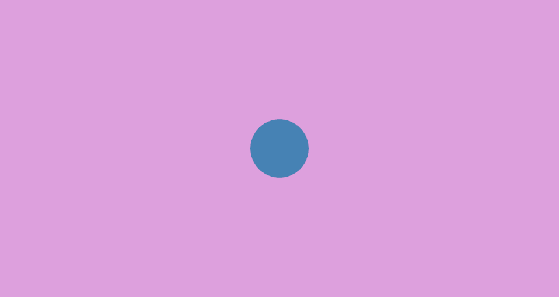
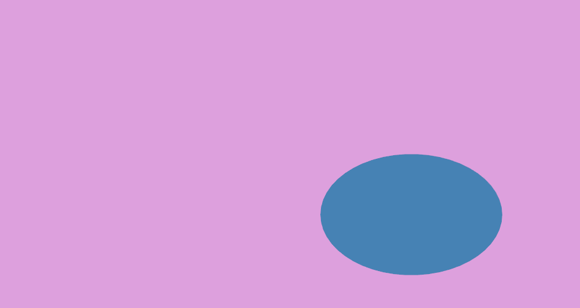
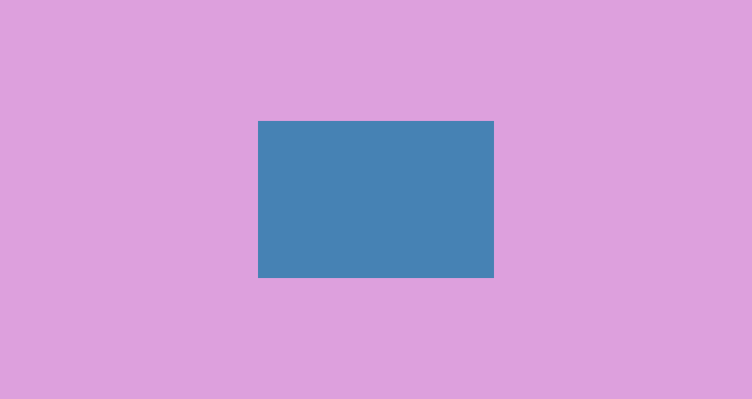
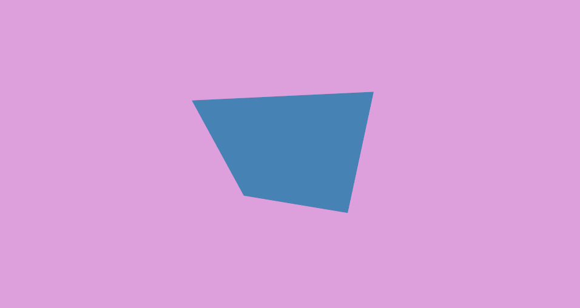
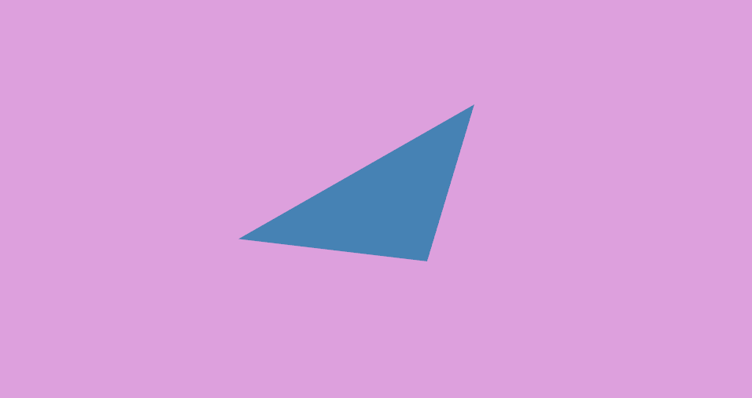
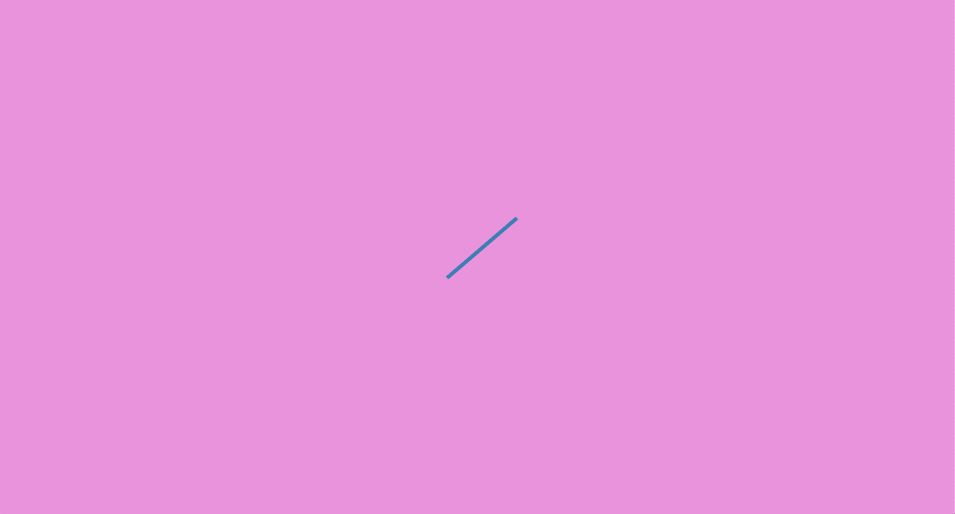
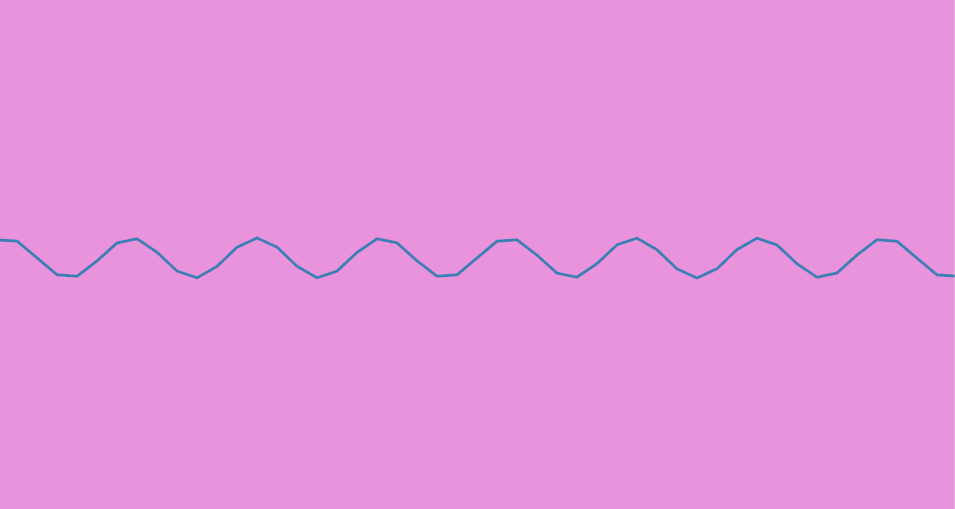
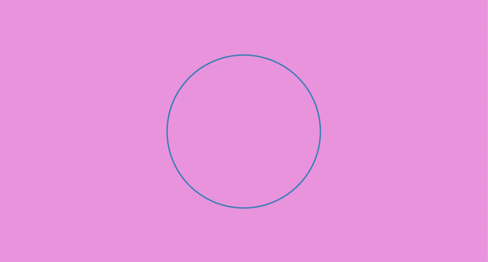
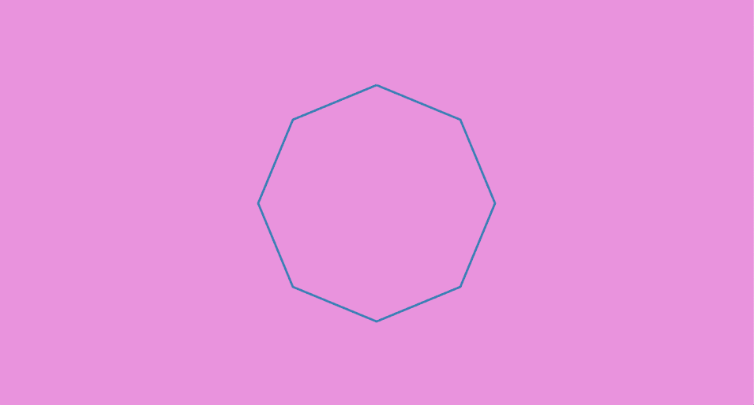
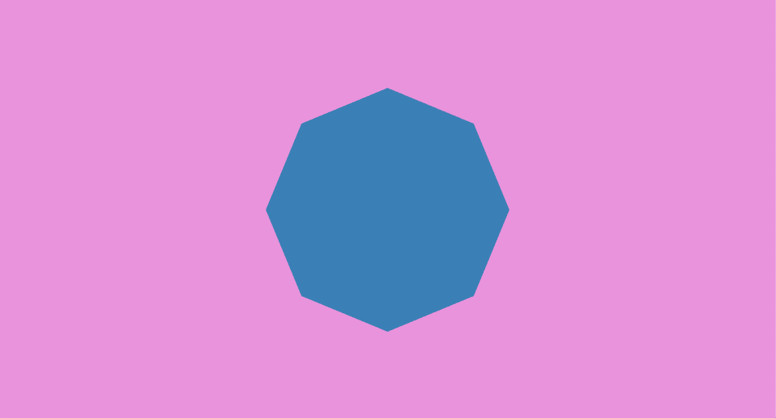

<!-- # Drawing 2D Shapes -->
# 2D図形を描く

<!-- **Tutorial Info** -->
**チュートリアル情報**

- 著者: Seth Boyles
- 必要な知識:
    - [はじめに](/getting_started.md)
    - [スケッチを描く](./draw-a-sketch.md)
- 読書時間：20分

---

<!-- In this tutorial we explore drawing 2D shapes with nannou. We will cover drawing basic lines, simple polygons (e.g. ellipses, rectangles, etc.), and more complex polygons where you can create whatever shape you'd like! -->
このチュートリアルでは、nannouを使って2Dの図形を描いてみましょう。基本的な線、単純な多角形（楕円、長方形など）、そしてより複雑な多角形（好きな形を作ることができる）を描きます！

<!-- To begin with, we will need a nannou project file to work with. Copy the following into new file: -->
まず始めに、作業用のnannouプロジェクト・ファイルが必要です。以下を新しいファイルにコピーしてください：

```rust,no_run
use nannou::prelude::*;

fn main() {
    nannou::sketch(view).run();
}

fn view(app: &App, frame: Frame) {
    // Prepare to draw.
    let draw = app.draw();

    // Clear the background to purple.
    draw.background().color(PLUM);

    // Draw a blue ellipse with default size and position.
    draw.ellipse().color(STEELBLUE);

    // Write to the window frame.
    draw.to_frame(app, &frame).unwrap();
}
```

<!-- You can also find this file, and other useful examples, in the [examples](https://github.com/nannou-org/nannou/tree/master/examples) directory of the nannou source repository. -->
このファイルや他の有用な例は、nannouソースリポジトリの[examples](https://github.com/nannou-org/nannou/tree/master/examples)ディレクトリにもあります。

<!-- ## Drawing Simple Shapes -->
## 単純な形を描く

<!-- Let's try running the file!  (if you haven't already, you will need to add this file to your Cargo.toml file) -->
このファイルを実行してみよう！ (まだの場合は、このファイルをCargo.tomlファイルに追加する必要があります)

<!-- You should a new window with something that looks like this: -->
次のような新しいウィンドウが表示されるはずだ：



<!-- Already we are rendering a circle to our canvas.  As you may have guessed, the line of code responsible for creating a circle is the call to the `ellipse` function: -->
すでに円をキャンバスにレンダリングしている。 お察しの通り、円を作成するコード行は `ellipse` 関数の呼び出しである：

```rust,no_run
# #![allow(unreachable_code, unused_variables)]
# use nannou::prelude::*;
# fn main() {
#     let draw: Draw = unimplemented!();
draw.ellipse()
    .color(STEELBLUE);
# }
```

<!-- There are many ways we can alter our circle here.  Let's start with changing the size: -->
ここで円を変更する方法はたくさんある。 まずは大きさを変えることから始めましょう：

```rust,no_run
# #![allow(unreachable_code, unused_variables)]
# use nannou::prelude::*;
# fn main() {
#     let draw: Draw = unimplemented!();
draw.ellipse()
    .color(STEELBLUE)
    .w(300.0)
    .h(200.0);
# }
```

<!-- The `w` function here changes the width of the ellipse to 300 pixels, and the `h` function changes the height to 200.0 pixels. You should see what we would more colloquially refer to as an ellipse. -->
`w`関数は楕円の幅を300ピクセルに変更し、`h`関数は高さを200.0ピクセルに変更します。楕円と呼ばれるものが見えるはずです。

<!-- We can also change the position of our ellipse with the `x_y` method: -->
`x_y`メソッドで楕円の位置を変えることもできる：

```rust,no_run
# #![allow(unreachable_code, unused_variables)]
# use nannou::prelude::*;
# fn main() {
#     let draw: Draw = unimplemented!();
draw.ellipse()
    .color(STEELBLUE)
    .w(300.0)
    .h(200.0)
    .x_y(200.0, -100.0);
# }
```



<!-- As you can see, we edit our ellipse by chaining together different methods which will change one or more properties of our shape.  This is called the **Builder** pattern.  The call to `draw.ellipse()` returns an object of type `Drawing<Ellipse>`.  In turn, each call to a builder method, such as `w(300.0)` or `x_y(200.0, -100.0)`, returns the same instance of our shape. By chaining these function calls, we are able to build an ellipse with the attributes we want. -->
ご覧のように、シェイプの1つまたは複数のプロパティを変更するさまざまなメソッドを連結して、楕円を編集します。これは **Builder** パターンと呼ばれます。`draw.ellipse()`の呼び出しは `Drawing<Ellipse>` 型のオブジェクトを返します。次に、`w(300.0)` や `x_y(200.0, -100.0)` などのビルダーメソッドを呼び出すと、同じシェイプのインスタンスが返されます。これらの関数呼び出しを連鎖させることで、欲しい属性を持つ楕円を作ることができる。

<!-- There are several more methods we can use to build our ellipse. You can view the documentation for many of these methods [here](https://docs.rs/nannou/latest/nannou/draw/struct.Drawing.html). -->
楕円を作るのに使えるメソッドは他にもいくつかある。これらのメソッドの多くのドキュメントは[こちら](https://docs.rs/nannou/latest/nannou/draw/struct.Drawing.html)で見ることができます。

<!-- ### Drawing Rectangles and Quadrilaterals -->
### 長方形と四角形を描く

<!-- Drawing a square or rectangle uses the same builder pattern that drawing an ellipse does.  In fact, it's similar enough that you can swap out `ellipse` with `rect` in the example above to get a working example: -->
正方形や長方形を描くには、楕円を描くのと同じビルダーパターンを使います。実際、上の例で`ellipse`を`rect`に置き換えても動作例が得られるくらい似ている：

```rust,no_run
# #![allow(unreachable_code, unused_variables)]
# use nannou::prelude::*;
# fn main() {
#     let draw: Draw = unimplemented!();
draw.rect()
    .color(STEELBLUE)
    .w(300.0)
    .h(200.0);
# }
```

<!-- You will see an image like this: -->
このような画像が表示されます：



<!-- In addition to `rect`, you can also use the `quad` method, which is for drawing quadrilaterals. This function is similar to `rect`, but you can also choose to supply your own coordinates for your shape.  Try the following: -->
`rect` に加えて、四角形を描くための `quad` メソッドも使用することができます。この関数は `rect` と似ていますが、図形に自分の座標を指定することもできます。 
次のようにしてみてください：

```rust,no_run
# #![allow(unreachable_code, unused_variables)]
# use nannou::prelude::*;
# fn main() {
#     let draw: Draw = unimplemented!();
let point1 = pt2(-10.0, -20.0);
let point2 = pt2(10.0, -30.0);
let point3 = pt2(15.0, 40.0);
let point4 = pt2(-20.0, 35.0);

draw.quad()
    .color(STEELBLUE)
    .w(300.0)
    .h(200.0)
    .points(point1, point2, point3, point4);
# }
```

<!-- You should see the following: -->
次のように表示されるはずだ：



<!-- The `pt2` method above will create a point object that represents a point in XY coordinate space, like a graph or a Cartesian plane. nannou's coordinate system places (0,0) at the center of the window. This is **not** like many other graphical creative coding frameworks, which place (0,0) at the upper-leftmost position of the window. -->
上の `pt2` メソッドは、グラフやデカルト平面のようなXY座標空間の点を表す点オブジェクトを作成します。nannouの座標系では、ウィンドウの中心に(0,0)を置きます。これは、(0,0)をウィンドウの左上に配置する他の多くのグラフィカル・クリエイティブ・コーディング・フレームワークとは**異なり**ます。

<!-- Note that while the `Drawing` builder objects for different shapes share many of the same builder methods, they do not share all of them.  Trying to use the method `points` on an instance of an `Drawing<Ellipse>`, for example, will raise an error. -->
異なる図形の `Drawing` ビルダーオブジェクトは多くのビルダーメソッドを共有していますが、そのすべてを共有しているわけではないことに注意してください。例えば、 `Drawing<Ellipse>` のインスタンスで `points` メソッドを使おうとするとエラーが発生します。

<!-- ### Drawing a Triangle -->
### 三角形を描く

<!-- Additionally, there is one more simple shape method: `tri`, for drawing triangles.  It behaves similarly to `quad`, where you can supply your own coordinates to decide how the shape looks.  Try it out! -->
さらに、三角形を描くための `tri` というシンプルなシェイプメソッドがもう一つある。このメソッドは `quad` と同じように動作し、座標を指定してシェイプの見え方を決めることができる。使ってみてください！



<!-- ## Drawing Lines -->
## 線を引く

<!-- The `line` function provides a simple way to draw a line: -->
`line`関数は線を引く簡単な方法を提供する：

```rust,no_run
# #![allow(unreachable_code, unused_variables)]
# use nannou::prelude::*;
# fn main() {
#     let draw: Draw = unimplemented!();
let start_point = pt2(-30.0, -20.0);
let end_point   = pt2(40.0, 40.0);

draw.line()
    .start(start_point)
    .end(end_point)
    .weight(4.0)
    .color(STEELBLUE);
# }
```



<!-- Simply provide a starting point and an ending point, and you have your line. -->
始点と終点を指定するだけで、ラインは完成する。

<!-- This is great for simpler drawings, but what if you want to draw something more complicated? A sine wave, for instance. -->
これは単純な図面には最適だが、もっと複雑なものを描きたい場合はどうすればいいのだろう？例えば正弦波だ。

<!-- To draw our sine wave, we will use the `polyline` function.  To use this function, we will supply a collection (or array) of points that represent points on a sine wave.  We can generate this array of points using&mdash;what else&mdash;the `sin` function! -->
正弦波を描くには、`polyline`関数を使います。この関数を使用するには、正弦波上の点を表す点のコレクション（または配列）を指定します。この点の配列を生成するには、`sin`関数を使います！

```rust,no_run
# #![allow(unreachable_code, unused_variables)]
# use nannou::prelude::*;
# fn main() {
#     let draw: Draw = unimplemented!();
let points = (0..50).map(|i| {
  let x = i as f32 - 25.0;          //subtract 25 to center the sine wave
  let point = pt2(x, x.sin()) * 20.0; //scale sine wave by 20.0
  (point, STEELBLUE)
});
draw.polyline()
    .weight(3.0)
    .points_colored(points);
# }
```



<!-- As you can see, the power of `polyline` is the ability to draw a series of lines connecting and ordered array of points.  With this, you can easily draw a variety of shapes or lines, so long as you can provide or generate the points you need to represent that shape. -->
見ての通り、`polyline`の威力は、並べられた点を結ぶ一連の線を描くことができることである。これを使えば、その形を表現するのに必要な点を提供したり生成したりすることができる限り、様々な形や線を簡単に描くことができる。

<!-- For example, a circle: -->
例えば円：

```rust,no_run
# #![allow(unreachable_code, unused_variables)]
# use nannou::prelude::*;
# fn main() {
#     let draw: Draw = unimplemented!();
// Store the radius of the circle we want to make.
let radius = 150.0;
// Map over an array of integers from 0 to 360 to represent the degrees in a circle.
let points = (0..=360).map(|i| {
    // Convert each degree to radians.
    let radian = deg_to_rad(i as f32);
    // Get the sine of the radian to find the x co-ordinate of this point of the circle
    // and multiply it by the radius.
    let x = radian.sin() * radius;
    // Do the same with cosine to find the y co-ordinate.
    let y = radian.cos() * radius;
    // Construct and return a point object with a color.
    (pt2(x,y), STEELBLUE)
});
// Create a polyline builder. Hot-tip: polyline is short-hand for a path that is
// drawn via "stroke" tessellation rather than "fill" tessellation.
draw.polyline()
    .weight(3.0)
    .points_colored(points); // Submit our points.
# }
```


<!-- A custom drawn circle! ...okay, perhaps this isn't too exciting, given that we already have an easy way of drawing circles with `ellipse`. But with a simple change to the above code we can generate an outline of a different shape. Let's try using the `step_by` function, which allows us to choose the interval at which we would like to step through a range or other iterator. So instead of calling `(0..=360).map`, we will call `(0..=360).step_by(45).map`: -->
カスタムで円を描く！...さて、これはあまりエキサイティングなことではないかもしれない。しかし、上のコードに簡単な変更を加えるだけで、別の形のアウトラインを生成することができる。`step_by`関数を使ってみよう。この関数では、範囲や他のイテレータをステップ実行する間隔を選ぶことができる。つまり、`(0..=360).map`を呼び出す代わりに、`(0..=360).step_by(45).map`を呼び出すことになる：

```rust,no_run
# #![allow(unused_variables)]
# fn main() {
let points = (0..=360).step_by(45).map(|i| {
#     0.0
# });
# }
```

<!-- The rest of our code will remain unchanged. -->
残りのコードは変更しない。

<!-- Because 45 divides into 360 eight times, our code generated 8 points to represent a regular octagon. -->
45は360に8回分割されるため、コードは正八角形を表す8点を生成した。



<!-- An octagon! -->
八角形！

<!-- Try experimenting with different values to pass into `step_by` and see the different shapes you can create! -->
`step_by`に渡す値をいろいろ変えてみて、いろいろな形が作れるか試してみてください！

<!-- As a side note, you may have noticed that we did not use a `color` function to set the drawing's color this time. Instead, `polyline` allows for each point to be colored uniquely. This means that you can change the color of the polyline point-by-point. Try experimenting with it! -->
余談だが、今回は `color` 関数を使って描画の色を設定していないことにお気づきだろうか。その代わり、`polyline` を使うと、各ポイントに独自の色をつけることができます。つまり、ポリラインの色を点ごとに変えることができるのです。いろいろ試してみてください！

<!-- ## Drawing Custom Polygons -->
## カスタム多角形の描画

<!-- To draw a custom filled-in polygon (and not just an outline), will we use code very similar to our custom circle or octagon code. The main difference is that instead of calling `polyline` to create a Builder, we call `polygon`: -->
カスタムで塗りつぶし多角形（アウトラインだけではない）を描くには、カスタム円やカスタム八角形のコードとよく似たコードを使います。主な違いは、ビルダーを作成するために `polyline` を呼び出す代わりに、`polygon` を呼び出すことです：

```rust,no_run
# #![allow(unreachable_code, unused_variables)]
# use nannou::prelude::*;
# fn main() {
#     let draw: Draw = unimplemented!();
let radius = 150.0;
let points = (0..=360).step_by(45).map(|i| {
    let radian = deg_to_rad(i as f32);
    let x = radian.sin() * radius;
    let y = radian.cos() * radius;
    (pt2(x,y), STEELBLUE)
});
draw.polygon()
    .points_colored(points);
# }
```



<!-- ## Concluding Remarks -->
## 結びの言葉

<!-- In this tutorial, we learned about most basic 2D drawing functions with nannou. -->
このチュートリアルでは、nannouを使った最も基本的な2D描画機能について学びました。

<!-- You can view the documentation for the different `Drawing` objects these return here: -->
これらのオブジェクトが返すさまざまな`Drawing`オブジェクトのドキュメントはこちらで見ることができます：

* [Ellipse](https://docs.rs/nannou/latest/nannou/draw/primitive/ellipse/struct.Ellipse.html)
* [Rect](https://docs.rs/nannou/latest/nannou/draw/primitive/rect/struct.Rect.html)
* [Quad](https://docs.rs/nannou/latest/nannou/draw/primitive/quad/struct.Quad.html)
* [Tri](https://docs.rs/nannou/latest/nannou/draw/primitive/tri/struct.Tri.html)
* [Polyline (or PathStroke)](https://docs.rs/nannou/latest/nannou/draw/primitive/path/type.PathStroke.html)
* [Polygon](https://docs.rs/nannou/latest/nannou/draw/primitive/polygon/struct.Polygon.html)

<!-- These links provide more information about other functions you can use to change your drawings in a variety of ways. -->
これらのリンクは、図面を様々な方法で変更するために使用できるその他の機能についての詳細情報を提供します。

<!-- You have now learned about some of the most commonly used functions for 2D drawing with nannou. Of course, this is just scratching the surface of ways in which you can generate shapes or polygons with nannou, but it should serve as a solid starting point in creating your own drawings. -->
nannouで2Dドローイングをするために最もよく使われる関数のいくつかを学びました。もちろん、これはnannouで図形や多角形を生成する方法のほんの表面をなぞったに過ぎませんが、あなた自身の図面を作成する際の確かな出発点として役立つはずです。

Happy coding!
