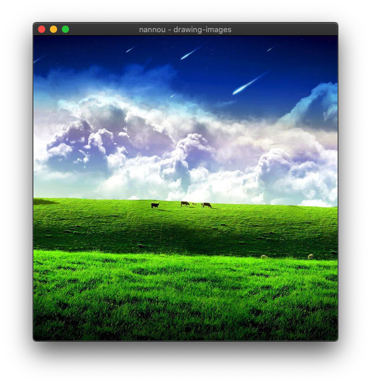
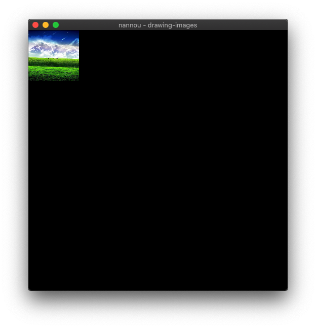

<!-- # Drawing Images -->
# ドローイング・イメージ

<!-- **Tutorial Info** -->
**チュートリアル情報**

- 著者: Josiah Savary
- 必要な知識:
    - [はじめに](/getting_started.md)
    - [スケッチを描く](./draw-a-sketch.md)
- 読書時間：20分

---

<!-- In this tutorial, we explore drawing images with nannou. We will cover loading textures from images in the app's assets directory, drawing them, and applying basic transformations. You can also find this file, and other useful examples, in the [examples](https://github.com/nannou-org/nannou/tree/master/examples) directory of the nannou source repository. -->
このチュートリアルでは、nannouを使って画像を描画する方法を学びます。アプリのassetsディレクトリにある画像からテクスチャを読み込み、それらを描画し、基本的な変形を適用します。このファイルや他の有用なサンプルは、nannouソースリポジトリの[examples](https://github.com/nannou-org/nannou/tree/master/examples)ディレクトリにもあります。

<!-- ## What is a Texture? -->
## テクスチャーとは？

<!-- Given the introductory nature of the tutorial, I'd like to briefly answer this question. To quote the [Learn Wgpu](https://sotrh.github.io/learn-wgpu) website: -->
チュートリアルの入門的な性格を考慮して、この質問に簡単に答えたいと思います。[Wgpuを学ぶ](https://sotrh.github.io/learn-wgpu)のウェブサイトを引用します：

<!-- > Textures are images overlayed over a triangle mesh to make the mesh seem more detailed. -->
> テクスチャとは、三角形のメッシュの上に重ねる画像で、メッシュをより詳細に見せるためのものです。

<!-- In short, this is how the GPU on your machine understands how to draw images. The [Textures and bind groups](https://sotrh.github.io/learn-wgpu/beginner/tutorial5-textures/#loading-an-image-from-a-file) is definitely worth a read for those who want to learn more. -->
要するに、これはあなたのマシンのGPUがどのように画像を描画するかを理解する方法です。[テクスチャとバインドグループ](https://sotrh.github.io/learn-wgpu/beginner/tutorial5-textures/#loading-an-image-from-a-file)は、もっと詳しく知りたい人にとって、間違いなく一読の価値があります。

<!-- ## Getting Started -->
## はじめに

<!-- To begin, we will need to bootstrap an `assets` directory with some images at the root of our project. I recommend copying the assets directory from the `nannou` repo itself to get started. This can be accomplished from the command line like so: -->
まずはじめに、プロジェクトのルートに `assets` ディレクトリと画像を作成します。`assets`ディレクトリを `nannou` リポジトリからコピーすることをお勧めする。これはコマンドラインから次のように実行できる：

```bash
git clone https://github.com/nannou-org/nannou.git
cp -r nannou/assets ./assets
rm -rf nannou
```

<!-- Once you have a fleshed-out `assets` directory at the root of your project, you'll be ready to return to your `main.rs` file for the following steps. -->
プロジェクトのルートに `assets` ディレクトリができたら、次のステップのために `main.rs` ファイルに戻る準備ができます。

<!-- ## Creating a Window -->
## ウィンドウの作成

<!-- We need somewhere to display the image, so first, let's create a window: -->
画像を表示する場所が必要なので、まずウィンドウを作成しよう：

```rust,no_run
# #![allow(unreachable_code, unused_variables, dead_code)]
use nannou::prelude::*;

struct Model {}

fn main() {
  nannou::app(model).run();
}

fn model(app: &App) -> Model {
  // Create a new window!
  app.new_window().size(512, 512).view(view).build().unwrap();
  Model {}
}

fn view(_app: &App, _model: &Model, _frame: Frame) {
}
```

<!-- If you `cargo run` your app, you'll see an empty window. -->
アプリを`cargo run`すると、空のウィンドウが表示される。

<!-- ## Setting up a Texture -->
## テクスチャの設定

<!-- Now, at the top of your `main.rs` file, add a [WGPU Texture](https://docs.rs/nannou/latest/nannou/wgpu/struct.Texture.html) type field named `texture` to the `Model` struct. -->
次に、`main.rs`ファイルの先頭で、`Model`構造体に`texture`という[WGPUテクスチャ](https://docs.rs/nannou/latest/nannou/wgpu/struct.Texture.html)タイプのフィールドを追加します。

```rust,no_run
# #![allow(unreachable_code, unused_variables, dead_code)]
# use nannou::prelude::*;
struct Model {
  texture: wgpu::Texture,
}
# fn main() {
#   nannou::app(model).run();
# }
# fn model(app: &App) -> Model {
#   // Create a new window!
#   app.new_window().size(512, 512).view(view).build().unwrap();
#   let texture: wgpu::Texture = unimplemented!();
#   Model { texture }
# }
# fn view(_app: &App, _model: &Model, _frame: Frame) {
# }
```

<!-- Next, we'll need to create a GPU texture to initialize the struct with. We can accomplish this by loading a texture from an image file after we create the window in our `model` function. We will let nannou find the assets directory for us using the app's [`assets_path()`](https://docs.rs/nannou/0.14.1/nannou/app/struct.App.html#method.assets_path) method, so we only need to spell out the image path from the root of that directory. -->
次に、構造体を初期化するためのGPUテクスチャを作成する必要があります。これは `model` 関数でウィンドウを作成した後に、画像ファイルからテクスチャをロードすることで実現できます。アプリの[`assets_path()`](https://docs.rs/nannou/0.14.1/nannou/app/struct.App.html#method.assets_path)メソッドを使ってnannouにassetsディレクトリを探させるので、そのディレクトリのルートから画像パスを指定するだけです。

```rust,no_run
# #![allow(unreachable_code, unused_variables, dead_code)]
# use nannou::prelude::*;
# struct Model {
#   texture: wgpu::Texture,
# }
# fn main() {
#   nannou::app(model).run();
# }
fn model(app: &App) -> Model {
  // Create a new window!
  app.new_window().size(512, 512).view(view).build().unwrap();
  // Load the image from disk and upload it to a GPU texture.
  let assets = app.assets_path().unwrap();
  let img_path = assets.join("images").join("nature").join("nature_1.jpg");
  let texture = wgpu::Texture::from_path(app, img_path).unwrap();
  Model { texture }
}
# fn view(_app: &App, _model: &Model, _frame: Frame) {
# }
```

<!-- After all that, we've still got an empty window...but not for much longer! -->
それでもまだ空のwindowはある！

<!-- ## Drawing a Texture -->
## テクスチャーを描く

<!-- Finally, in our `view` function, we can draw the texture stored in our model with the `texture` method of the [App's Draw API](https://docs.rs/nannou/latest/nannou/draw/struct.Draw.html). -->
最後に、`view`関数で、[App's Draw API](https://docs.rs/nannou/latest/nannou/draw/struct.Draw.html)の`texture`メソッドを使って、モデルに保存されているテクスチャを描画することができる。

```rust,no_run
# #![allow(unreachable_code, unused_variables, dead_code)]
# use nannou::prelude::*;
# struct Model {
#   texture: wgpu::Texture,
# }
# fn main() {
#   nannou::app(model).run();
# }
# fn model(app: &App) -> Model {
#   // Create a new window!
#   app.new_window().size(512, 512).view(view).build().unwrap();
#   // Load the image from disk and upload it to a GPU texture.
#   let assets = app.assets_path().unwrap();
#   let img_path = assets.join("images").join("nature").join("nature_1.jpg");
#   let texture = wgpu::Texture::from_path(app, img_path).unwrap();
#   Model { texture }
# }
fn view(app: &App, model: &Model, frame: Frame) {
  frame.clear(BLACK);

  let draw = app.draw();
  draw.texture(&model.texture);

  draw.to_frame(app, &frame).unwrap();
}
```


<!-- ## Translating and Scaling the Texture -->
## テクスチャの変換と拡大縮小

<!-- A texture can be drawn at any location and any size desired within the frame. Let's say we wanted to draw this image in a 100x100 square at the top-left corner of the window. Our `view` function might look similar to the following. -->
テクスチャはフレーム内の好きな場所に好きな大きさで描くことができる。例えば、この画像をウィンドウの左上に100x100の正方形で描画したいとします。`view`関数は次のようになる。

```rust,no_run
# #![allow(unreachable_code, unused_variables, dead_code)]
# use nannou::prelude::*;
# struct Model {
#   texture: wgpu::Texture,
# }
# fn main() {
#   nannou::app(model).run();
# }
# fn model(app: &App) -> Model {
#   // Create a new window!
#   app.new_window().size(512, 512).view(view).build().unwrap();
#   // Load the image from disk and upload it to a GPU texture.
#   let assets = app.assets_path().unwrap();
#   let img_path = assets.join("images").join("nature").join("nature_1.jpg");
#   let texture = wgpu::Texture::from_path(app, img_path).unwrap();
#   Model { texture }
# }
fn view(app: &App, model: &Model, frame: Frame) {
  frame.clear(BLACK);

  let win = app.window_rect();
  let r = Rect::from_w_h(100.0, 100.0).top_left_of(win);

  let draw = app.draw();
  draw.texture(&model.texture)
    .xy(r.xy())
    .wh(r.wh());

  draw.to_frame(app, &frame).unwrap();
}
```



